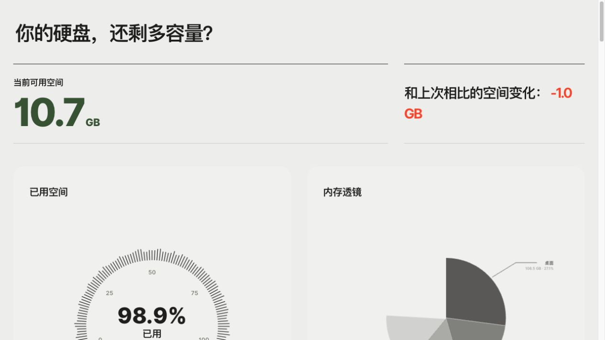
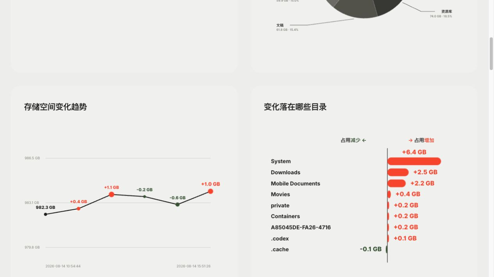

# 存储观察站

一个面向 macOS、Windows、Linux 及其他 Unix-like 系统的、手动触发的存储空间观察与可视化报告工具。它每次被启用时记录一枚只读快照，把当前磁盘状态、历史变化、占用来源和清理决策放进同一份跨平台 HTML 报告。

当前版本：**1.0.0-beta1**

## 是什么

存储观察站不是一个常驻后台清理器，也不创建每日定时任务。它更像一台“手动按下快门”的硬盘观察仪：每次启用 skill，就扫描当前状态并保存一份快照；下一次启用时，再把两次结果进行比较。

报告主要回答这些问题：

- 现在硬盘总容量、已用空间和可用空间分别是多少？
- 和上一次快照相比，已用空间增加还是减少了多少？
- 空间主要落在哪些根目录、用户目录和文件夹？
- 变化具体发生在哪些目录？
- 哪些缓存可以优先处理，哪些内容需要人工判断，哪些项目不建议手动删除？
- 当前的目录统计能否和 APFS / 文件系统的总容量对账？

报告使用十进制容量单位展示数据：1 TB = 1000 GB。同时保留物理磁盘、文件系统和目录扫描之间的口径差异；macOS 额外展示 APFS 容器关系，避免把厂商标称容量、系统显示容量以及某个目录扫描结果混为一谈。

## 为什么要用

当“上次还剩 200 GB，这次只剩 4 GB”时，单看 Finder 或系统设置通常只能看到结果，不能回答“究竟是哪一批内容发生了变化”。存储观察站把每次手动检查变成有时间线的记录，让一次突然的容量变化可以回溯、比较和定位。

它尤其适合以下场景：

- 硬盘空间突然下降，想知道增长来自哪里；
- 系统显示的容量与文件系统工具、文件管理器或目录扫描不一致，需要区分物理盘、文件系统、用户目录和未展开项目；
- 不希望每天自动扫描，只在自己需要时留下一个可比较的快照；
- 希望看到图表，而不是面对一堆难以阅读的终端输出；
- 想清理缓存，但又不想把应用数据、系统文件或仍在使用的内容误删。

## 截图

首屏先展示当前硬盘状态，使用梅子绿表达当前可用空间等正向状态，用橙色表达空间变少、占用增加等不利变化；中文说明文字保持中性黑色。

趋势图最多保留六个快照点；内存透镜展示当前用户一级目录中占用最高的文件夹；目录变化图用左右对称的横条表达占用减少与增加。

## 来源与关系

### 两个来源

1. **躺平图标 / Lieflat Charts**

   - 参考技能：Lieflat Charts
   - 本机参考目录：躺平图标的本地 Lieflat Charts 工作区
   - 上游项目：[larashero3-dotcom/lieflat-charts](https://github.com/larashero3-dotcom/lieflat-charts)

   它主要影响存储观察站的图表表达：编辑部式留白、单一色系、明度层级、手写 SVG、旁注引线、可视区域内的 reveal 动画，以及 F11 Tick Gauge、F12 Dumbbell Queue、F2 Hairline Line、G10 Diverging Bar 等图表语法的参考方式。存储观察站不是把 gallery 整页复制过来，而是从相应图表结构出发重新组合成一份存储报告。

2. **原存储分析器**

   - 来源技能：原存储分析器
   - 本项目不复制原存储分析器的私有工作区、快照或报告数据
   - 原项目链接：[KKKKhazix/khazix-skills/tree/main/storage-analyzer](https://github.com/KKKKhazix/khazix-skills/tree/main/storage-analyzer)

   本机版本与公开来源的 SKILL.md 行数和 SHA-256 均不同，说明它不是未经修改的复制，而是在该来源基础上继续扩展和改写。原项目主要提供存储分析的语义和安全基础：macOS 只读扫描、总容量与目录口径区分、占用分类、清理决策清单、缓存与用户数据的判断方式，以及“移到废纸篓优先、直接删除需谨慎”的安全边界。存储观察站在此基础上增加了手动快照历史、差异报告、全盘根目录对账和可视化观察流程。

### 许可证提示

Lieflat Charts 本机来源目录附带 PolyForm Noncommercial License 1.0.0。本项目保留其来源链接和归属说明，不在此 README 中重新许可上游内容。若要把存储观察站或其中的衍生视觉资产对外发布，尤其是用于商业用途，应先阅读并遵守上游许可证及来源目录中的 LICENSE 文件。

## 主要能力

### 手动快照，而不是定时监控

每次启用存储观察站自动记录一次快照；不需要另外说“执行一次存储快照”，也不会每天在后台执行。快照保存在工作区的 work/snapshots/，历史趋势默认最多显示最近六个点。

### 容量口径与根目录对账

报告会区分物理磁盘、APFS 容器、根文件系统和目录扫描结果，并尽量展示系统、架构、文件系统、磁盘布局、扫描耗时、扫描目录数和权限不足数。根目录逐项统计包含 /Applications、/Users、/Library、/System、/private、/opt、/usr 等；无法展开的部分和未使用空间单列，便于和总容量对账。

### 变化定位

趋势图显示已用空间，而不是把可用空间当作主指标。第一枚节点显示具体的已用空间，后续节点显示相对上一次快照的变化值。目录变化图按占用减少 / 占用增加分成两侧，并让条形长度按变化量比例表达。

### 内存透镜

内存透镜展示当前用户一级目录中占用最高的十个文件夹。饼图面积编码占用比例，外部文字通过引线连接到对应扇区；标签在密集区域可以动态上移或下移，以优先保证引线逻辑和可读性，而不是把文字卡死在同一条水平线上。

### 清理决策清单

清理清单不是“全盘都能删”的列表，而是把确实存在处理决策的项目分成三类：可自动清理、需人工判断、谨慎清理。每项显示总占用、比例条、内容说明和适合的下一步。服务模式下，纯缓存可以移到废纸篓；需要判断的项目优先打开位置；系统文件、应用核心数据和不明确项目不会被后台直接删除。

## 怎么用

### 1. 在 Codex 中使用

启用独立 skill：**存储观察站**。

启用后会自动完成一次只读快照并刷新报告。不要把它当成每日自动任务；需要记录时再启用即可。原来的存储分析器保持独立，不会被这个 skill 覆盖。

### 2. 用命令手动记录一次快照

~~~bash
REPO_ROOT="$(pwd)"
WORKSPACE="$REPO_ROOT/.storage-observatory-workspace"

python3 "$REPO_ROOT/scripts/run_snapshot.py" \
  --workspace "$WORKSPACE"
~~~

运行结束后，最新快照会写入：

~~~text
$WORKSPACE/work/storage-snapshots/
~~~

### 3. 打开静态报告

静态报告适合阅读和留存，不包含可以直接操作文件系统的按钮：

~~~bash
open "$WORKSPACE/outputs/storage-observatory-report.html"
~~~

### 4. 启动带操作按钮的本地预览

如果需要“打开位置”或“移到废纸篓”等操作，使用 localhost 服务：

~~~bash
python3 "$REPO_ROOT/scripts/server.py" \
  --workspace "$WORKSPACE"
~~~

使用命令输出的最新 http://127.0.0.1:<port>/ 地址打开网页。每次服务重启端口可能不同，不要继续使用已经退出服务的旧地址。遇到 not found 或连接失败时，重新启动服务并使用新地址。

打开前可以先检查服务是否真的返回 200：

~~~bash
curl -fsS http://127.0.0.1:<port>/ >/dev/null \
  && echo "preview: 200"
~~~

### 5. 查看输出文件

~~~text
$WORKSPACE/
├── work/
│   ├── storage-snapshots/          # 每次手动执行留下的快照
│   └── storage-analysis-live.json  # 当前分析数据
├── outputs/
│   └── storage-observatory-report.html
├── docs/
│   └── screenshots/                # README 截图
└── evals/
    └── evals.json                  # 可视化与数据检查项
~~~

## 数据与安全边界

扫描阶段只读：macOS 使用 df、du、diskutil 等系统工具，Windows 使用 Python 标准库和系统 Shell，Linux/Unix 使用 Python 标准库读取容量和目录信息。扫描时不会删除、移动、改权限或清空回收站。

网页中的危险操作只在本地服务模式出现，并受 localhost、随机 token、路径白名单、真实路径校验、用户目录边界和点击确认保护。静态 HTML 不具备直接操作文件系统的能力。清理动作优先采用可逆的“移到废纸篓”；“直接删除”不作为默认路径，也不会自动清空废纸篓。

数据不完整时，报告应显示缺失或权限受限，而不是静默填成 0。所有容量和图表数值都应保持有限且可解释，不能出现 NaN、Infinity 或 undefined。

## 开发与维护

源代码和独立 skill：

~~~text
storage-cleanup-visual/
├── SKILL.md
├── scripts/run_snapshot.py
├── scripts/scan.py
├── scripts/build_storage_report.py
├── scripts/server.py
├── references/macos.md
├── references/windows.md
└── references/linux.md
~~~

当前是独立调试工作区中的 beta 版本，尚未建立 Git fork、远端或发布包。修改报告时应优先保持以下约定：一次启用一次快照；历史趋势最多六点；图表进入可视区域后再播放且不重复播放；保留 prefers-reduced-motion 降级；保持 #43593B 表示好的变化、#F5572F 表示不好的变化，中文说明文字使用中性黑色。

## 版本状态

**1.0.0-beta1**：功能和视觉方向基本定稿；报告层跨平台共用，macOS 扫描流程已验证，Windows 与 Linux/Unix 使用平台适配器。后续新增平台能力或改变既有行为时，建议记录为 beta2。
